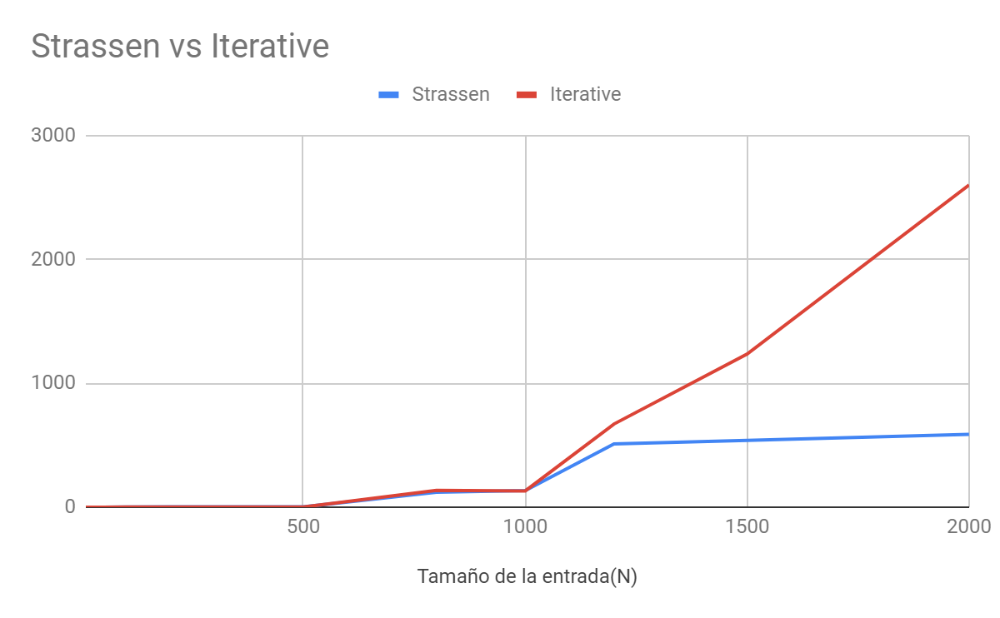

<!----- Conversion time: 4.139 seconds.


Using this Markdown file:

1. Cut and paste this output into your source file.
2. See the notes and action items below regarding this conversion run.
3. Check the rendered output (headings, lists, code blocks, tables) for proper
   formatting and use a linkchecker before you publish this page.

Conversion notes:

* Docs to Markdown version 1.0β16
* Mon Mar 11 2019 15:38:41 GMT-0700 (PDT)
* Source doc: https://docs.google.com/open?id=1GED5mcD8Rneojj8Z5vTCL3CQq0ihFnpFMm6WrEeAoAI
* This document has images: check for >>>>>  gd2md-html alert:  inline image link in generated source and store images to your server.

WARNING:
You have 5 H1 headings. You may want to use the "H1 -> H2" option to demote all headings by one level.

----->


<p style="color: red; font-weight: bold">>>>>>  gd2md-html alert:  ERRORs: 0; WARNINGs: 1; ALERTS: 15.</p>
<ul style="color: red; font-weight: bold"><li>See top comment block for details on ERRORs and WARNINGs. <li>In the converted Markdown or HTML, search for inline alerts that start with >>>>>  gd2md-html alert:  for specific instances that need correction.</ul>

<p style="color: red; font-weight: bold">Links to alert messages:</p><a href="#gdcalert1">alert1</a>
<a href="#gdcalert2">alert2</a>
<a href="#gdcalert3">alert3</a>
<a href="#gdcalert4">alert4</a>
<a href="#gdcalert5">alert5</a>
<a href="#gdcalert6">alert6</a>
<a href="#gdcalert7">alert7</a>
<a href="#gdcalert8">alert8</a>
<a href="#gdcalert9">alert9</a>
<a href="#gdcalert10">alert10</a>
<a href="#gdcalert11">alert11</a>
<a href="#gdcalert12">alert12</a>
<a href="#gdcalert13">alert13</a>
<a href="#gdcalert14">alert14</a>
<a href="#gdcalert15">alert15</a>

<p style="color: red; font-weight: bold">>>>>> PLEASE check and correct alert issues and delete this message and the inline alerts.<hr></p>


# Informe práctica 2


# Introducción

Strassen es un algoritmo recursivo que reduce a siete los subproblmeas para multiplicar dos matrices. Lo que hace que tenga una complejidad mucho menor que el algoritmo tradicional.

Si tenemos:


<p id="gdcalert1" ><span style="color: red; font-weight: bold">>>>>>  gd2md-html alert: inline image link here (to images/Informe-Strassen0.png). Store image on your image server and adjust path/filename if necessary. </span><br>(<a href="#">Back to top</a>)(<a href="#gdcalert2">Next alert</a>)<br><span style="color: red; font-weight: bold">>>>>> </span></p>


Los pasos son los siguientes_:_

Descomponemos nuestras matrices en 4 subM:


<p id="gdcalert2" ><span style="color: red; font-weight: bold">>>>>>  gd2md-html alert: inline image link here (to images/Informe-Strassen1.png). Store image on your image server and adjust path/filename if necessary. </span><br>(<a href="#">Back to top</a>)(<a href="#gdcalert3">Next alert</a>)<br><span style="color: red; font-weight: bold">>>>>> </span></p>


Definimos que sus productos son: 


<p id="gdcalert3" ><span style="color: red; font-weight: bold">>>>>>  gd2md-html alert: inline image link here (to images/Informe-Strassen2.png). Store image on your image server and adjust path/filename if necessary. </span><br>(<a href="#">Back to top</a>)(<a href="#gdcalert4">Next alert</a>)<br><span style="color: red; font-weight: bold">>>>>> </span></p>


<p id="gdcalert4" ><span style="color: red; font-weight: bold">>>>>>  gd2md-html alert: inline image link here (to images/Informe-Strassen3.png). Store image on your image server and adjust path/filename if necessary. </span><br>(<a href="#">Back to top</a>)(<a href="#gdcalert5">Next alert</a>)<br><span style="color: red; font-weight: bold">>>>>> </span></p>


<p id="gdcalert5" ><span style="color: red; font-weight: bold">>>>>>  gd2md-html alert: inline image link here (to images/Informe-Strassen4.png). Store image on your image server and adjust path/filename if necessary. </span><br>(<a href="#">Back to top</a>)(<a href="#gdcalert6">Next alert</a>)<br><span style="color: red; font-weight: bold">>>>>> </span></p>


   


<p id="gdcalert6" ><span style="color: red; font-weight: bold">>>>>>  gd2md-html alert: inline image link here (to images/Informe-Strassen5.png). Store image on your image server and adjust path/filename if necessary. </span><br>(<a href="#">Back to top</a>)(<a href="#gdcalert7">Next alert</a>)<br><span style="color: red; font-weight: bold">>>>>> </span></p>


Con esto tenemos 8 subproblemas por lo que no mejora el algoritmo tradicional de **O<sup>3 </sup>**

La parte que añadió Strassen es reducir esto 8 productos a 7 de la siguiente forma:


<p id="gdcalert7" ><span style="color: red; font-weight: bold">>>>>>  gd2md-html alert: inline image link here (to images/Informe-Strassen6.png). Store image on your image server and adjust path/filename if necessary. </span><br>(<a href="#">Back to top</a>)(<a href="#gdcalert8">Next alert</a>)<br><span style="color: red; font-weight: bold">>>>>> </span></p>


<p id="gdcalert8" ><span style="color: red; font-weight: bold">>>>>>  gd2md-html alert: inline image link here (to images/Informe-Strassen7.png). Store image on your image server and adjust path/filename if necessary. </span><br>(<a href="#">Back to top</a>)(<a href="#gdcalert9">Next alert</a>)<br><span style="color: red; font-weight: bold">>>>>> </span></p>


<p id="gdcalert9" ><span style="color: red; font-weight: bold">>>>>>  gd2md-html alert: inline image link here (to images/Informe-Strassen8.png). Store image on your image server and adjust path/filename if necessary. </span><br>(<a href="#">Back to top</a>)(<a href="#gdcalert10">Next alert</a>)<br><span style="color: red; font-weight: bold">>>>>> </span></p>


<p id="gdcalert10" ><span style="color: red; font-weight: bold">>>>>>  gd2md-html alert: inline image link here (to images/Informe-Strassen9.png). Store image on your image server and adjust path/filename if necessary. </span><br>(<a href="#">Back to top</a>)(<a href="#gdcalert11">Next alert</a>)<br><span style="color: red; font-weight: bold">>>>>> </span></p>


<p id="gdcalert11" ><span style="color: red; font-weight: bold">>>>>>  gd2md-html alert: inline image link here (to images/Informe-Strassen10.png). Store image on your image server and adjust path/filename if necessary. </span><br>(<a href="#">Back to top</a>)(<a href="#gdcalert12">Next alert</a>)<br><span style="color: red; font-weight: bold">>>>>> </span></p>


<p id="gdcalert12" ><span style="color: red; font-weight: bold">>>>>>  gd2md-html alert: inline image link here (to images/Informe-Strassen11.png). Store image on your image server and adjust path/filename if necessary. </span><br>(<a href="#">Back to top</a>)(<a href="#gdcalert13">Next alert</a>)<br><span style="color: red; font-weight: bold">>>>>> </span></p>


<p id="gdcalert13" ><span style="color: red; font-weight: bold">>>>>>  gd2md-html alert: inline image link here (to images/Informe-Strassen12.png). Store image on your image server and adjust path/filename if necessary. </span><br>(<a href="#">Back to top</a>)(<a href="#gdcalert14">Next alert</a>)<br><span style="color: red; font-weight: bold">>>>>> </span></p>


# 


# PseudoCodigo


```
 int[][] StrassenMultiply(int[][] A, int[][] B) {
        int n = A.length;
        int[][] res = new int[n][n];
        // if the input matrix is 1x1
        if (n == 1) {
            res[0][0] = A[0][0] * B[0][0];
        } else {
            // first matrix
            int[][] a,b,c,d = new int[n / 2][n / 2];;
            // second matrix
            int[][] e, f, g, h = new int[n / 2][n / 2];
            // dividing matrix A into 4 parts
            divArr(A, a, 0, 0);
            divArr(A, b, 0, n / 2);
            divArr(A, c, n / 2, 0);
            divArr(A, d, n / 2, n / 2);
            // dividing matrix B into 4 parts
            divArr(B, e, 0, 0);
            divArr(B, f, 0, n / 2);
            divArr(B, g, n / 2, 0);
            divArr(B, h, n / 2, n / 2);

            int[][] p1 = StrassenMultiply(addM(a, d), addM(e, h));
            int[][] p2 = StrassenMultiply(addM(c,d),e);
            int[][] p3 = StrassenMultiply(a, subM(f, h));           
            int[][] p4 = StrassenMultiply(d, subM(g, e));
            int[][] p5 = StrassenMultiply(addM(a,b), h);
            int[][] p6 = StrassenMultiply(subM(c, a), addM(e, f));
            int[][] p7 = StrassenMultiply(subM(b, d), addM(g, h));        

            int[][] C11 = addM(subM(addM(p1, p4), p5), p7);
            int[][] C12 = addM(p3, p5);
            int[][] C21 = addM(p2, p4);
            int[][] C22 = addM(subM(addM(p1, p3), p2), p6);

            // adding all subarray back into one
            cpySubArr(C11, res, 0, 0);
            cpySubArr(C12, res, 0, n / 2);
            cpySubArr(C21, res, n / 2, 0);
            cpySubArr(C22, res, n / 2, n / 2);
        }
        return res;
    }
```


## 


## Analizando el código

La fórmula de recursión que obtenemos es la siguiente:


<table>
  <tr>
   <td>T(n) = { \
  Θ(1) if n = 1, \
  7T(n/2) + Θ(n <sup>2</sup>) if n > 1
<p>
}
   </td>
  </tr>
  <tr>
   <td>Para nuestro caso el número de subproblemas a = 7
<p>
En nuestro caso el tamaño de los subproblemas b = n/2
<p>
El exponente de combinación d = 2
<p>
El tiempo en dividir el problema D(n) es 1 
<p>
El tiempo en combinar el problema C(n) es n<sup>2</sup>
   </td>
  </tr>
  <tr>
   <td>Utilizando el <a href="https://es.wikipedia.org/wiki/Teorema_maestro">Teoréma méstro</a>
<p>
Estamos en el caso 1:
<p>
El algoritmo de Strassen pertenece a: <strong>Θ(n log<sup>2</sup>(7)). </strong>Asi que es <strong>Θ(n<sup>2.81</sup>).</strong>
   </td>
  </tr>
</table>


## Analizando los resultados experimentales


### Tabla datos de los experimentos y la función calculada


<table>
  <tr>
   <td><strong>Tamaño de la entrada(N)</strong>
   </td>
   <td><strong>Strassen</strong>
   </td>
   <td><strong>Iterative</strong>
   </td>
  </tr>
  <tr>
   <td>10
   </td>
   <td>0.002333333333
   </td>
   <td>0.006333333333
   </td>
  </tr>
  <tr>
   <td>20
   </td>
   <td>0.01533333333
   </td>
   <td>0.06333333333
   </td>
  </tr>
  <tr>
   <td>50
   </td>
   <td>0.04633333333
   </td>
   <td>0.005666666667
   </td>
  </tr>
  <tr>
   <td>100
   </td>
   <td>0.272
   </td>
   <td>0.6396666667
   </td>
  </tr>
  <tr>
   <td>200
   </td>
   <td>1.941333333
   </td>
   <td>0.7136666667
   </td>
  </tr>
  <tr>
   <td>300
   </td>
   <td>1.894
   </td>
   <td>0.7533333333
   </td>
  </tr>
  <tr>
   <td>500
   </td>
   <td>1.963
   </td>
   <td>0.8473333333
   </td>
  </tr>
  <tr>
   <td>800
   </td>
   <td>120.095
   </td>
   <td>135.4166667
   </td>
  </tr>
  <tr>
   <td>1000
   </td>
   <td>134.1946667
   </td>
   <td>130.9193333
   </td>
  </tr>
  <tr>
   <td>1200
   </td>
   <td>510.147
   </td>
   <td>670.8986667
   </td>
  </tr>
  <tr>
   <td>1500
   </td>
   <td>538.445
   </td>
   <td>1236.147667
   </td>
  </tr>
  <tr>
   <td>2000
   </td>
   <td>587.089
   </td>
   <td>2600.333333
   </td>
  </tr>
</table>


### Gráfica del algoritmo Strassen y del algoritmo Iterativo experimental


<p id="gdcalert14" ><span style="color: red; font-weight: bold">>>>>>  gd2md-html alert: inline image link here (to images/Informe-Strassen13.png). Store image on your image server and adjust path/filename if necessary. </span><br>(<a href="#">Back to top</a>)(<a href="#gdcalert15">Next alert</a>)<br><span style="color: red; font-weight: bold">>>>>> </span></p>





### Gráfica del algoritmo Strassen y del algoritmo Iterativo esperada


<p id="gdcalert15" ><span style="color: red; font-weight: bold">>>>>>  gd2md-html alert: inline image link here (to images/Informe-Strassen14.png). Store image on your image server and adjust path/filename if necessary. </span><br>(<a href="#">Back to top</a>)(<a href="#gdcalert16">Next alert</a>)<br><span style="color: red; font-weight: bold">>>>>> </span></p>


# Conclusiones

Las conclusiones que sacamos del análisis es que tiene algunos errores ya que los tiempo de ejecución variaba mucho de unas pruebas a otras por lo tanto debe haber algo interfiriendo en el proceso. Aún así con algunos datos de prueba vemos que efectivamente la relación se cumple bastante acertadamente. Ya que en al segunda gráfica podemos apreciar el parecido a la primera. Strassen es un método que aunque a priori no parece reducir mucho el exponente nos damos cuenta que en tamaños de **N** muy grandes la diferencia es abismal.


# Referencias

**Algoritmo de Strassen, (s. f). En Wikipedia. Recuperado el 5 de Marzo de 2018 de [https://es.wikipedia.org/wiki/Algoritmo_de_Strassen](https://es.wikipedia.org/wiki/Algoritmo_de_Strassen)**

**Strassen algorithm, (s. f). En Wikipedia. Recuperado el 5 de Marzo de 2018 de [https://en.wikipedia.org/wiki/Strassen_algorithm](https://en.wikipedia.org/wiki/Strassen_algorithm)**

**Grupo Guíame. (31 de diciembre de 2017). Multiplicación de Karatsuba y Matrices de Strassen [Video de Youtube]. Recuperado de [https://www.youtube.com/watch?v=6cBSAkzzQzU](https://www.youtube.com/watch?v=6cBSAkzzQzU&t=755s)**


<!-- Docs to Markdown version 1.0β16 -->
